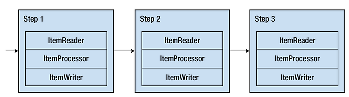
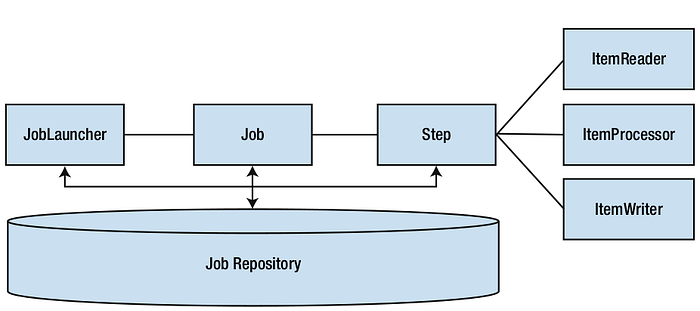

<p align="center">
    
     </a>  
     <a href="https://github.com/ms-sales/README.md/commits/master">
      
     </a>
     <a href="https://github.com/rafaelrok/ms-sales/blob/main/LICENSE">
      
     </a>  
     <a href="https://github.com/tgmarinho/README-ecoleta/stargazers">
      
     </a>
     <a href="https://medium.com/@rafael">
      
     </a>
  </p>
Esse projeto tem como base de estudo de sistemas que realiza um processamento infinito de dados controlados pela batch com Jobs. 
Spring Batch é um framework que surgiu da necessidade de realizar processamento em lote. A afirmação “os dados são o novo petróleo” deve ser familiar para você. 
A nuvem armazena uma enorme quantidade de dados, que cresce com o tempo. Portanto, é importante que os sistemas sejam capazes de consultar e armazenar esses dados 
em tempo hábil, sem impactar a experiência do usuário.

<!--— Esses são exemplos. Veja https://shields.io --->
## Tecnologias

* **Java 17**
* **Spring Boot**
* **Spring Batch**
* **API REST**
* **Docker**
* **MySQL**

## Arquitetura do Spring Batch

O Spring Batch veio para facilitar o processo de criação de jobs . Um job no Spring Batch é basicamente uma máquina de estados com sequência de etapas ( steps ) que possui uma lógica própria.:



Os componentes que compõe essa máquina de estados são exibidos na imagem abaixo:



### Fluxo Batch

- *Job Repository*: Mantém o estado do *job* (duração da execução, status da execução, erros, escritas, leituras, …), que é compartilhado com os outros componentes da solução.
- *Step*: Representa uma etapa ou passo na qual uma lógica é realizada. *Etapas* são encadeadas para obter o produto final do processamento. Se o *passo* for baseado em [*chunk](https://docs.spring.io/spring-batch/docs/current/reference/html/step.html#chunkOrientedProcessing)* (pedaços), ele terá etapas de leitura (ItemReader), processamento (ItemProcessor) e escrita de dados (ItemWriter). O *step* também pode ser uma tarefa simples, e nesse caso seria baseada em [*tasklets*](https://docs.spring.io/spring-batch/docs/current/reference/html/step.html#taskletStep) .
- *Job Launcher*: Executa o *job* de fato, considerando fator como forma de execução ( *thread* único , distribuído), validação de parâmetros, *restart* , e outras propriedades de execução.

## Principais Recursos

### Observação:
>Para todos os projetos batch que envolve processamento de arquivos ou scripts deve ser configurado o parametro para indetificar o seu files da seguinte forma:
 
```
arquivoClientes=file:{NOME_DO_PROJETO}/files/clientes.txt
```

Para atender a diversos cenários, o Spring Batch conta com uma série de recursos que permitem a elaboração de uma solução que atende ao máximo seus requisitos funcionais e não funcionais. Vamos listar algumas delas:

> #Leitura de banco de dados: Essa é uma funcionalidade essencial. Muitos *trabalhos* fazem leitura e escrita em banco de dados, por isso o Spring Batch já fornece [componentes](https://docs.spring.io/spring-batch/docs/current/reference/html/readersAndWriters.html#database) de acesso ao banco de forma diferenciada (paginada, em lote, transacional, …).
>

> Manipulação de arquivos: Assim como em banco de dados, a leitura e escrita em arquivos é algo muito comum em *jobs* . Pensando nisso, o Spring Batch disponibiliza diferentes [manipuladores de arquivo](https://docs.spring.io/spring-batch/docs/current/reference/html/readersAndWriters.html#flatFiles) , que podem ser escolhidos de acordo com a natureza dos dados a serem lidos.
>

> Tratamento de abordagens: É importante que um *trabalho* se recupere de falhas sem comprometer o processamento. Para isso, existem [mecanismos de *nova tentativa* e manipuladores de exceção](https://docs.spring.io/spring-batch/docs/current/reference/html/readersAndWriters.html#faultTolerant) para que o *job* comece mantendo seu estado consistente para posteriores reinicializações.
>

> *Restart* : Essa capacidade é essencial para *lotes* atrasados, que podem ter sua execução interrompida. Seria muito custoso começar o processamento do zero, por isso o Spring Batch possui um [mecanismo de reinicialização](https://docs.spring.io/spring-batch/docs/current/reference/html/job.html#restartability) , que utiliza os [metadados do *trabalho](https://docs.spring.io/spring-batch/docs/current/reference/html/schema-appendix.html#metaDataSchema)* salvos em sua última execução para retomá-la.
>

> Paralelismo: Existem [opções](https://docs.spring.io/spring-batch/docs/current/reference/html/scalability.html#scalability) que permitem escalar a aplicação horizontalmente ( *chunking* e particionamento remoto) e verticalmente ( *steps* paralelos e *multithread* ). Isso é importante para melhorar o tempo de processamento quando uma abordagem de único *thread* não é suficiente.
>

## Processamento Batch
O processamento batch (ou processamento em lote) é uma abordagem para processar grandes volumes de dados em um ambiente computacional. Em vez de tratar dados individualmente e em tempo real, 
como no processamento transacional ou online (OLTP), o processamento batch acumula dados e os processa todos de uma vez em intervalos regulares ou programados. Essa abordagem é muito utilizada 
em diversos contextos, como sistemas corporativos, ciência de dados, big data, e operações de TI.


## Características do Processamento Batch

1. **Volume de Dados**:
    >- Processa grandes volumes de dados de uma só vez.
    >- Ideal para tarefas que requerem manipulação de um grande conjunto de registros, como a geração de relatórios, análises de dados e backups.
2. **Agendamento**:
    >- Tarefas batch são geralmente agendadas para serem executadas em horários específicos, como durante a noite ou nos fins de semana, para minimizar o impacto no desempenho do sistema durante as horas de pico.
3. **Automação**:
    >- Muitas vezes, o processamento batch é automatizado e não requer intervenção humana contínua após ser configurado.
4. **Recursos Computacionais**:
    >- Pode utilizar intensivamente recursos computacionais (CPU, memória, disco), mas como é agendado, pode ser planejado para momentos de baixa utilização.
5. **Latência**:
    >- Geralmente, a latência não é crítica. Os resultados não são necessários em tempo real, então há um atraso aceitável entre o início do processamento e a disponibilidade dos resultados.

### Exemplos de Uso

1. **Processamento de Folha de Pagamento**:
    - Calcula os salários dos funcionários, deduções, impostos e gera relatórios e pagamentos. Normalmente executado mensalmente.
2. **Relatórios Empresariais**:
    - Geração de relatórios financeiros, de vendas ou de inventário a partir dos dados acumulados ao longo do dia, semana ou mês.
3. **ETL (Extract, Transform, Load)**:
    - Extração de dados de várias fontes, transformação desses dados conforme necessário e carregamento em um data warehouse.
4. **Backups de Sistemas**:
    - Criação de backups de sistemas e bancos de dados, muitas vezes agendados para horários fora do expediente para evitar interrupções.

### Tecnologias e Ferramentas

- **Apache Hadoop**:
    - Framework para processamento de grandes conjuntos de dados em um ambiente distribuído.
- **Apache Spark**:
    - Motor de processamento de dados de código aberto que pode ser usado tanto para processamento batch quanto para processamento em tempo real.
- **Spring Batch**:
    - Framework no ecossistema Spring projetado para facilitar o desenvolvimento de aplicações de processamento batch.
- **MapReduce**:
    - Modelo de programação associado ao Hadoop para processamento e geração de grandes conjuntos de dados.

### Vantagens do Processamento Batch

- **Eficiência**:
    - Pode ser mais eficiente do que o processamento em tempo real para grandes volumes de dados, uma vez que opera em blocos.
- **Agendamento**:
    - Flexibilidade para agendar tarefas em horários que minimizem o impacto no desempenho do sistema.
- **Automação**:
    - Reduz a necessidade de intervenção manual contínua após a configuração inicial.

### Desvantagens do Processamento Batch

- **Latência**:
    - Não é adequado para tarefas que exigem respostas em tempo real.
- **Recursos**:
    - Pode consumir muitos recursos de sistema, o que pode impactar outras operações se não for bem gerenciado.
- **Complexidade**:
    - Configuração e manutenção podem ser complexas, especialmente em ambientes distribuídos.

## Tipo de Steps “Tasklet” e “Chunk”
O `Tasklet` é uma interface simples usada para definir uma única tarefa dentro de um step. Essa tarefa pode ser qualquer operação simples e atômica, como deletar arquivos, 
fazer uma limpeza de dados, ou qualquer outra lógica que precise ser executada como uma única unidade de trabalho.

Exemplo de `Tasklet`
```java
@Configuration
@EnableBatchProcessing
public class TaskletConfig {

    @Autowired
    private JobBuilderFactory jobBuilderFactory;

    @Autowired
    private StepBuilderFactory stepBuilderFactory;

    @Bean
    public Tasklet tasklet() {
        return (StepContribution contribution, ChunkContext chunkContext) -> {
            System.out.println("Olá, mundo! - Tasklet");
            return RepeatStatus.FINISHED;
        };
    }

    @Bean
    public Step taskletStep() {
        return stepBuilderFactory
                .get("taskletStep")
                .tasklet(tasklet())
                .build();
    }

    @Bean
    public Job taskletJob() {
        return jobBuilderFactory
                .get("taskletJob")
                .start(taskletStep())
                .build();
    }
}
```
### Chunk

O processamento `Chunk` é usado para lidar com grandes volumes de dados que precisam ser processados em blocos ou pedaços. O Spring Batch divide os dados em pedaços menores, processa cada pedaço, e então escreve o resultado. Essa abordagem é mais eficiente para operações de leitura/gravação em massa.

No `Chunk` processing, você define três componentes principais:

1. **ItemReader**: Leitura de dados.
2. **ItemProcessor**: Processamento de dados.
3. **ItemWriter**: Escrita dos dados processados.

Exemplo de `Chunk`
```java
@Configuration
@EnableBatchProcessing
public class ChunkConfig {

    @Autowired
    private JobBuilderFactory jobBuilderFactory;

    @Autowired
    private StepBuilderFactory stepBuilderFactory;

    @Bean
    public ItemReader<String> reader() {
        List<String> data = Arrays.asList("Primeiro", "Segundo", "Terceiro");
        return new ListItemReader<>(data);
    }

    @Bean
    public ItemProcessor<String, String> processor() {
        return item -> item.toUpperCase();
    }

    @Bean
    public ItemWriter<String> writer() {
        return items -> items.forEach(System.out::println);
    }

    @Bean
    public Step chunkStep() {
        return stepBuilderFactory.get("chunkStep")
                .<String, String>chunk(2)
                .reader(reader())
                .processor(processor())
                .writer(writer())
                .build();
    }

    @Bean
    public Job chunkJob() {
        return jobBuilderFactory
                .get("chunkJob")
                .start(chunkStep())
                .build();
    }
}
```
### Diferenças entre Tasklet e Chunk

- **Granularidade**:
    - `Tasklet` é usado para tarefas atômicas ou unitárias.
    - `Chunk` é usado para processar grandes volumes de dados em pedaços menores.
- **Complexidade**:
    - `Tasklet` é mais simples e direto, adequado para tarefas simples.
    - `Chunk` envolve mais componentes (leitura, processamento, escrita) e é mais adequado para tarefas complexas de processamento de dados.
- **Uso de memória**:
    - `Tasklet` geralmente consome menos memória, pois lida com pequenas tarefas.
    - `Chunk` pode consumir mais memória dependendo do tamanho dos pedaços e dos dados processados.

Com essas explicações e exemplos, você deve ser capaz de implementar e entender a diferença entre `Tasklet` e `Chunk` no Spring Batch, e escolher o mais adequado para suas necessidades de processamento de dados.
esse projeto tem como base de estudo de sistemas que realiza um processamento infinito de dados controlados pela batch com Jobs.
aqui pode consultar e testar os projetos nesse repositorio.

## Desenvolvedor
<table>
  <tr>
    <td align="center">
      <a href="#">
        <br>
        <sub>
          <b>Rafael Vieira</b>
        </sub>
      </a>
    </td>
  </tr>
</table>
<table>
  <tr>
    <a href="https://www.linkedin.com/in/rafaelvieira-s/">
      
    </a>
    <a href="https://medium.com/@rafael">
      
    </a>
    <a href = "mailto:rafaelrok25@gmail.com">
      
    </a>
  </tr>
</table>


## 📝 Licença

Esse projeto está sob licença. Veja o arquivo [LICENÇA](LICENSE.md) para mais detalhes.

##  Versões do README

[⬆ Voltar ao topo](#Tecnologias)<br>
